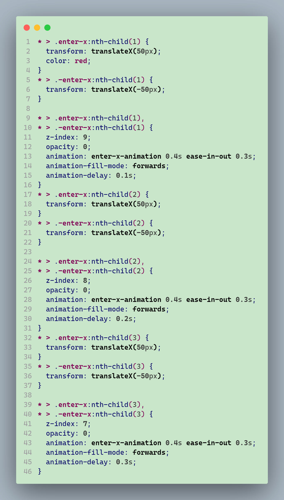
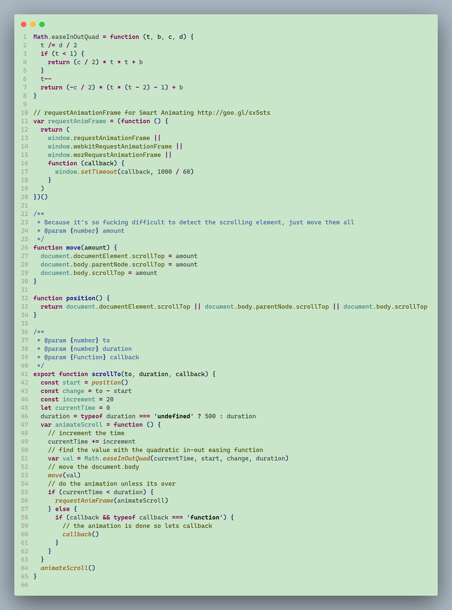

# 👁️ Relax Your Eyes Green

A VSCode color theme that works to relieve eyestrain:)

## ❗ NOTE

Work in Progress：The plugin is currently in continuous development - (When I have a free night)

Currently only available in the following languages or frameworks:

- HTML
- CSS
- JavaScript
- TypeScript
- Vue

## 📦 Installation

This extension is available for free in the [Visual Studio Code Marketplace](https://marketplace.visualstudio.com/items?itemName=shiloh.relax-your-eyes-green)

### Manual

Download the .vsix file from the [release page](https://github.com/shilohooo/vscode-color-theme-relax-your-eyes-green/releases) to install it

## 📸 Screenshots

HTML

CSS

JavaScript

TypeScript

Vue

## 🎉 Thanks

- [Relax Your Eyes Green - ThemesMap](http://www.themesmap.com/details.html?id=56af4d27333ecc1800c392b3)
- [Atom One Light Theme](https://github.com/akamud/vscode-theme-onelight)

## 💡 Tips

If you are using JetBrains IDE in your development, such as IntelliJ IDEA, WebStorm, DataGrip, etc...

You can find the Color Theme Plugin developed by [Nisus-Liu here](https://plugins.jetbrains.com/plugin/20163-relax-your-eyes-green-theme), which is useful for relieving eyestrain:)

## 🔖 LICENSE

[MIT](./LICENSE)
