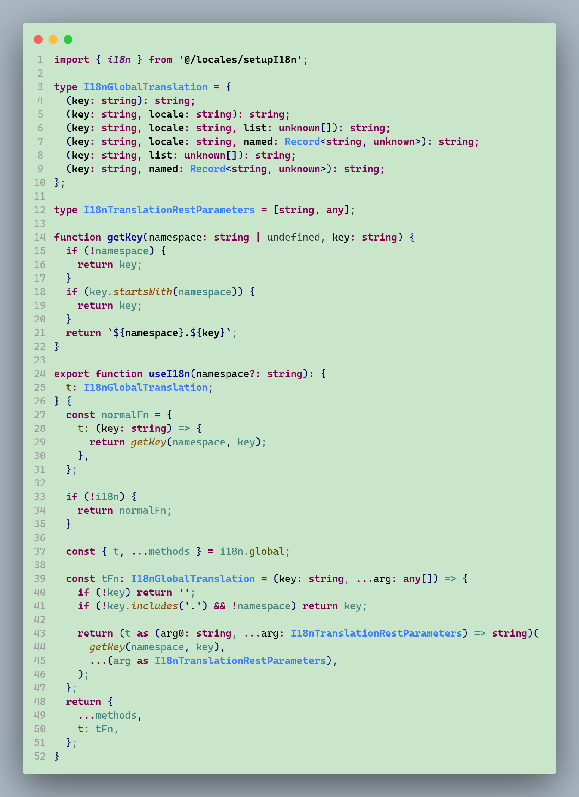

# Relax Your Eyes Green

A VSCode color theme that works to relieve eyestrain:)

## NOTE

Work in Progress：The plugin is currently in continuous development - (When I have a free night)

Currently only available in the following languages or frameworks:

- HTML
- JavaScript
- TypeScript
- Vue

## Screenshots

### HTML

### Vue

### TypeScript

## Thanks

- [Relax Your Eyes Green - ThemesMap](http://www.themesmap.com/details.html?id=56af4d27333ecc1800c392b3)
- [Atom One Light Theme](https://github.com/akamud/vscode-theme-onelight)

## LICENSE

[MIT](./LICENSE)
